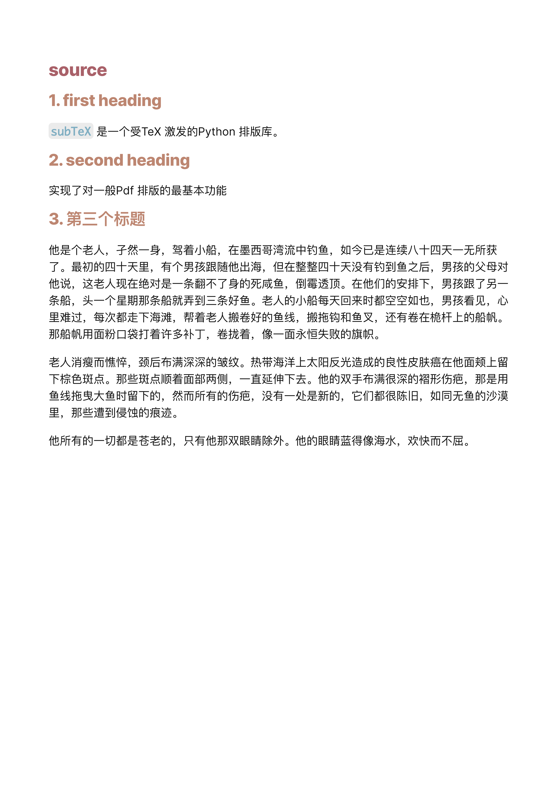

# subTeX
本系统通过较为简单的Python代码实现了TeX格式的排版。subTeX是一个简化版的TeX排版引擎，它只实现了实际使用中最常用的功能，使用户能够快速生成精美的TeX样式排版。作为一个基于Python语言开发的工具，subTeX主要使用了Pyside2库来实现其排版功能。

## 功能介绍
subTeX能够接受文本文件、Markdown文件和.tex文件等多种格式的输入，经过语法分析后转化为subTeX内部支持的命令格式。之后，程序将逐行解析这些命令，并将内容绘制到目标文件上。最终生成的文件格式为PDF，以便用户方便地查看和打印。

以下是subTeX内部命令支持的一些功能：

- 居中绘制：根据用户的需要设置文本居中排列。
- 左对齐绘制：让文本左对齐排列，符合大多数阅读习惯。
- 段落绘制：自动检测段落并进行优化排版，包括：
    - 生成所有可行的断行位置，并计算得出最优的断行位置。
    - 连字算法：智能处理文本中的连字符，提高阅读体验。
- 设置行间距：允许用户自定义行间距，增强排版的灵活性。
- 增加纵向间隔：可根据需要调整段落之间的纵向间距。
- 绘制页眉页尾：支持自定义页眉和页尾，使文档看起来更专业。
- 字体选择：提供多种字体可供选择，满足不同用户的审美需求。
- 页面格式设置：允许用户自定义页面大小、边距等参数，以适应各种打印需求。

subTeX作为一个简单的命令行工具，旨在帮助用户探索TeX排版引擎的核心原理以及如何用Python实现一个基本的排版系统。虽然它的功能相对有限，但对于初学者和对排版要求不高的场景来说，subTeX是一个轻量级、易上手的解决方案。

## 应用场景
1. 学术论文排版：对于撰写学术论文的研究人员，subTeX可以帮助他们生成具有专业外观的论文，以满足期刊或会议的排版要求。通过使用subTeX内置的字体选择、段落绘制和页面格式设置等功能，用户可以轻松地实现优美的排版效果。

2. 个人简历制作：求职者可以使用subTeX来制作精美的个人简历。subTeX提供的居中绘制、左对齐绘制等功能，使得求职者能够根据自己的需求排列简历内容，同时利用页眉页尾功能来展示个人信息和联系方式。

3. 项目报告编写：团队在完成一个项目后，可能需要提交一份详细的项目报告。借助subTeX的段落绘制、设置行间距和增加纵向间隔等功能，团队成员可以轻松地创建出结构清晰、易于阅读的报告。

4. 教材编排：教师或教育工作者可使用subTeX来制作教材。通过调整字体、行间距和页面格式等参数，教材的外观将更具吸引力，同时也有利于学生进行阅读和学习。

5. 会议海报设计：参加学术会议的研究人员可以使用subTeX制作具有美观排版的海报。通过调整字体大小和样式、设置行间距以及自定义页面格式，用户可将研究成果以直观的方式展示在海报上，吸引观众的注意力。

6. 个人博客文章排版：博主可以利用subTeX对博客文章进行优美的排版处理。从而提高文章的阅读体验，使内容更容易吸引读者。同时，生成的PDF文件还可以方便地分享给其他人。

总之，subTeX适用于许多需要精美排版的场景。虽然它功能相对简化，但对于日常应用和初级用户来说已经足够满足需求。
## version 2
  增加了对Markdown 文件和 tex 文件的编译支持。
通过将markdown和tex 解析到 subTeX 使用的命令，完成Pdf 格式的输出。

在下文markdown 示例， tex 示例可以看到subTeX 生成与其他引擎生成的pdf 的对比。

---
## 示例
### 中文示例

[zh_example/book.pdf](https://github.com/Brant-B/subTeX/blob/master/zh_example/book.pdf)

### 英文示例

[en_example/book.pdf](https://github.com/Brant-B/subTeX/blob/master/en_example/book.pdf)

### markdown示例
subTeX 生成：

markdown 软件生成：

### tex 示例
subTeX 生成：

plain TeX 引擎生成：

---
