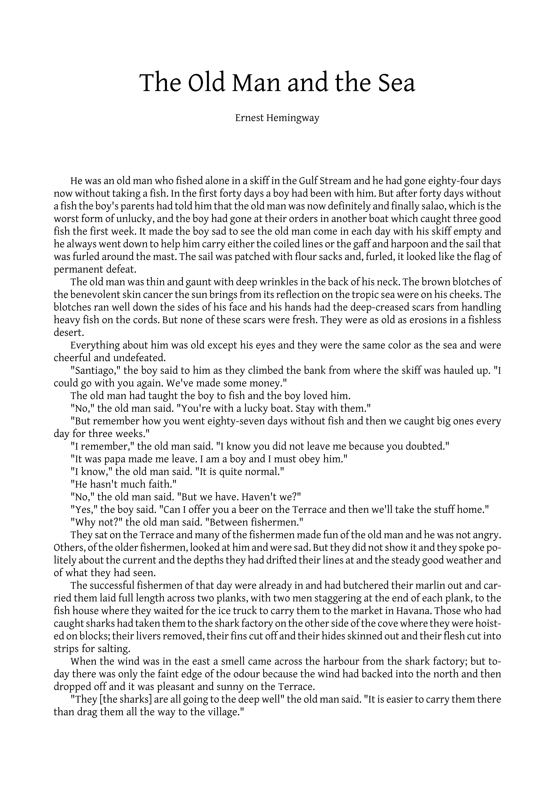
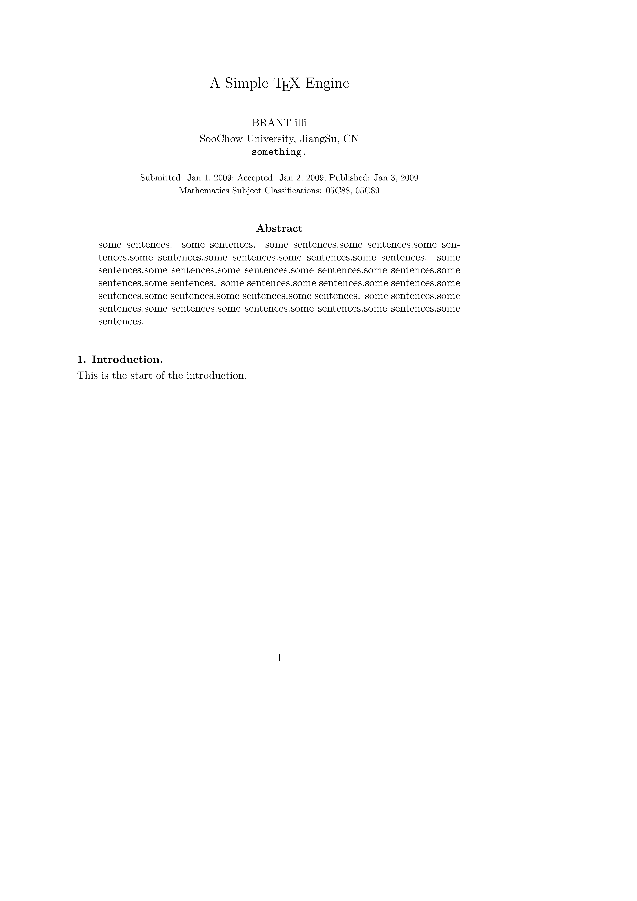

# subTeX

`subTeX` 是一个受TeX 激发的Python 排版库。

实现了对一般Pdf 排版的最基本功能：
- 页面绘制
- 字体选择
- 页头页尾
- 断行算法
- 连字算法
- 标记语言常有的功能
  - 标题
  - 子标题
  - 空白间隔
## version 2
  增加了对Markdown 文本和 tex 文本的支持。
将markdown和tex 解析到 subTeX 使用的命令，完成Pdf 格式的输出。
下面有示例与对比。
可以到 example 文件夹中查看文件。

---
## 示例
### 中文示例

[zh_example/book.pdf](https://github.com/Brant-B/subTeX/blob/master/zh_example/book.pdf)

### 英文示例

[en_example/book.pdf](https://github.com/Brant-B/subTeX/blob/master/en_example/book.pdf)

### markdown示例

### tex 示例
subTeX 生成：

plain TeX 引擎生成：

---
